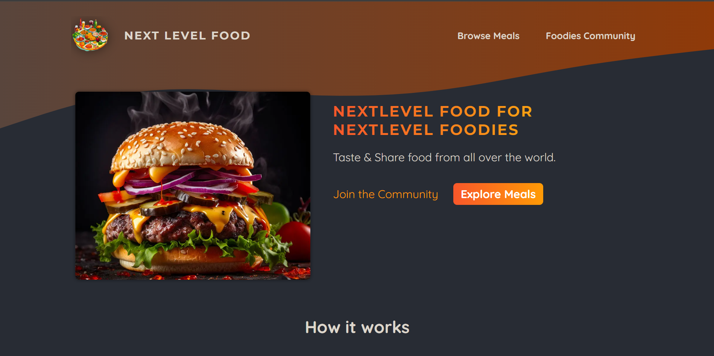
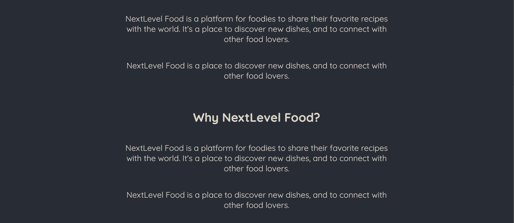
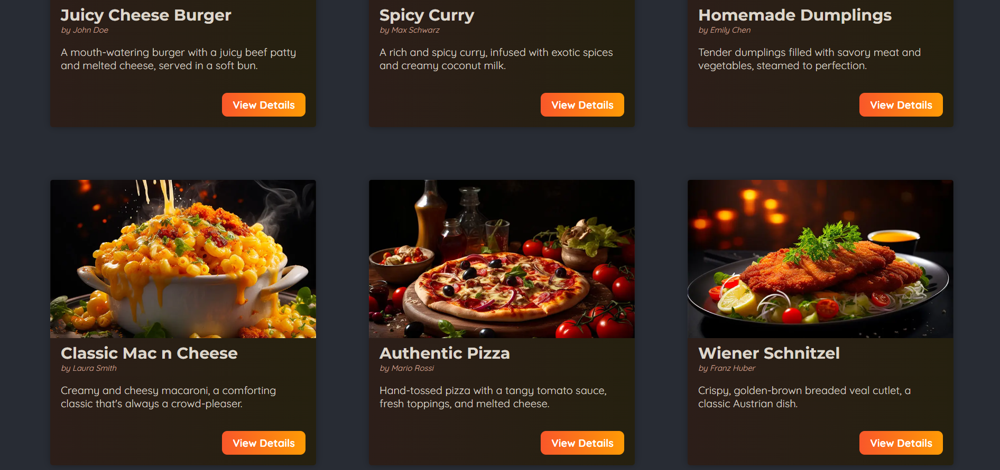
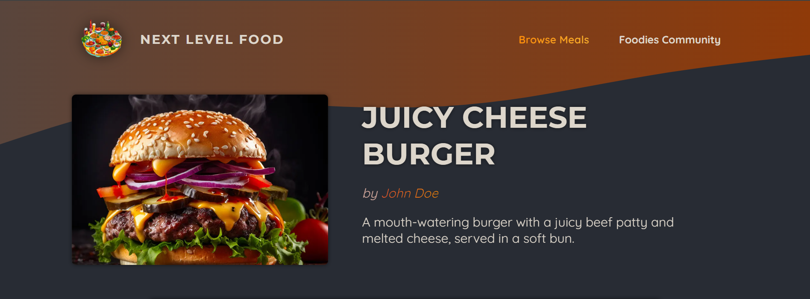
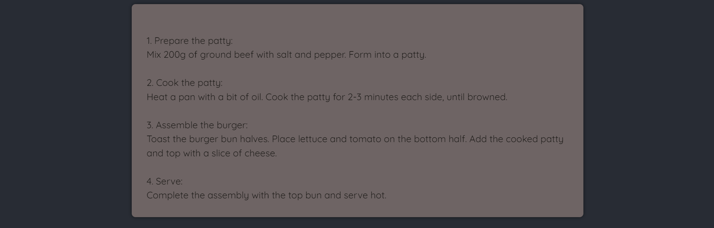
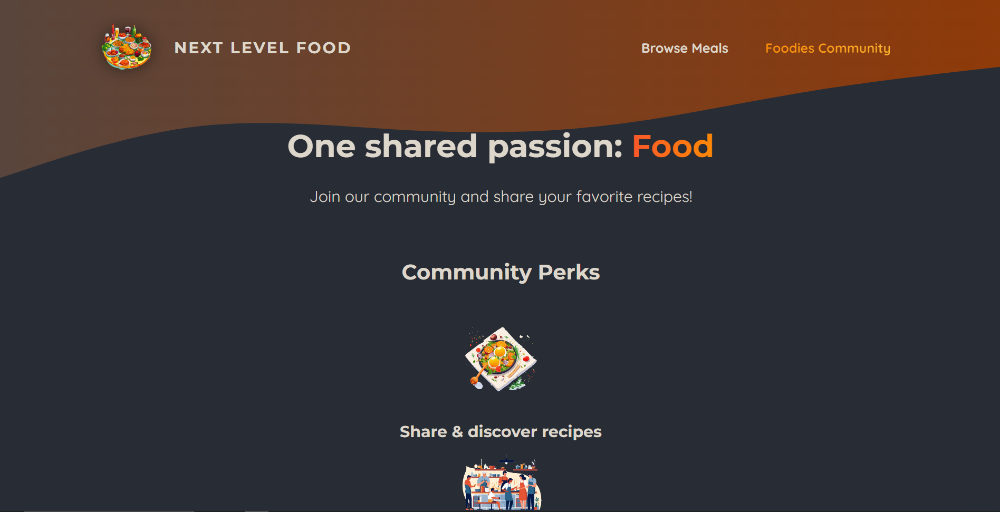

### Foodies Project

The Foodies project is a comprehensive application developed with Next.js, allowing users to browse a variety of meals, add your own and share with community.

## Table of Contents

- [Project Description](#project-description)
- [Features](#features)
- [Screenshots](#screenshots)
- [Technologies Used](#technologies-used)
- [Installation](#installation)
- [Usage](#usage)
- [Contributing](#contributing)

## Project Description

The Foodies project demonstrates the application of modern web development techniques using Next.js. It integrates a server-side rendered (SSR) front-end with React, along with a minimal back-end.

## Features

- Browse available meals
- Add new meals

## Screenshots

Here are some screenshots of the application:

### Home page




### Meals page




### Details of meal




### Share page




## Technologies Used

- **Frontend/Backend:** Next.js
- **Database:** SQLite
- **Styling:** CSS modules

## Installation

Follow these steps to set up the project locally:

### Prerequisites

- Node.js installed (version 14 or higher recommended)
- npm (Node Package Manager)

### Clone the Repository

```bash
git clone https://github.com/Roman-Manzhelii/foodies-project.git
cd foodies-project
```

### Install Dependencies

Navigate to the project root directory and run:

```bash
npm install
```

## Usage

### Running the Server

In the root directory, start the server:

```bash
npm run dev
```

The application will be available on `http://localhost:3000`.


## Contributing

Contributions are welcome! Please follow these steps:

1. Fork the repository
2. Create a new branch (`git checkout -b feature-branch`)
3. Make your changes
4. Commit your changes (`git commit -m 'Add some feature'`)
5. Push to the branch (`git push origin feature-branch`)
6. Open a pull request

